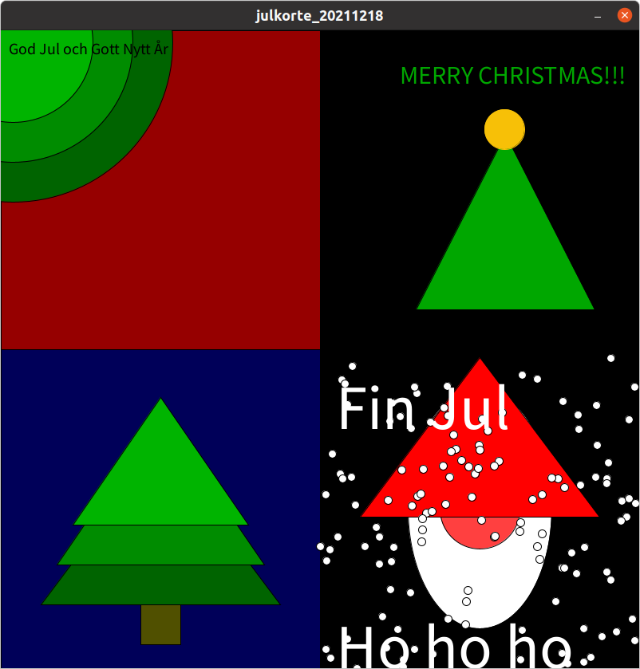
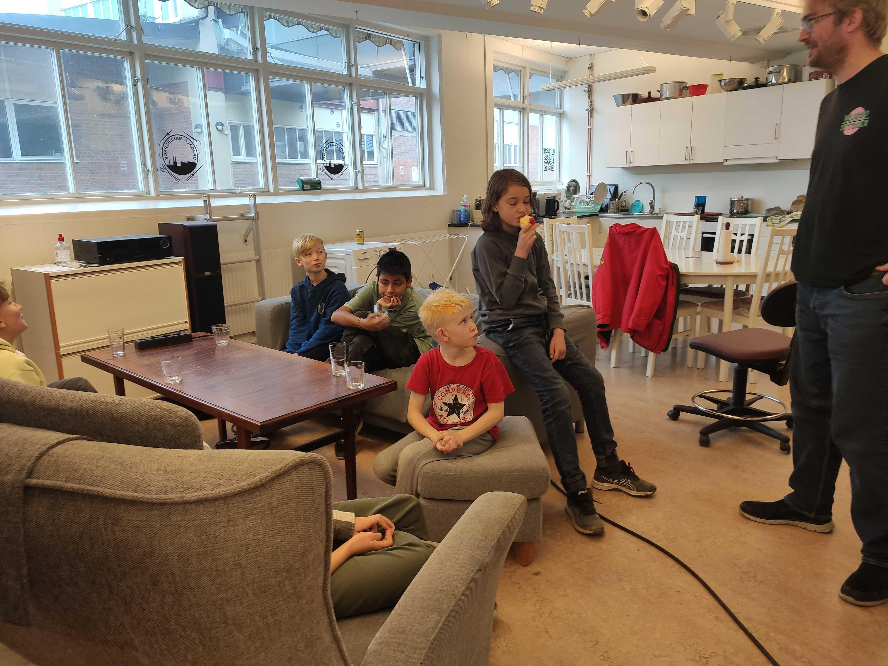
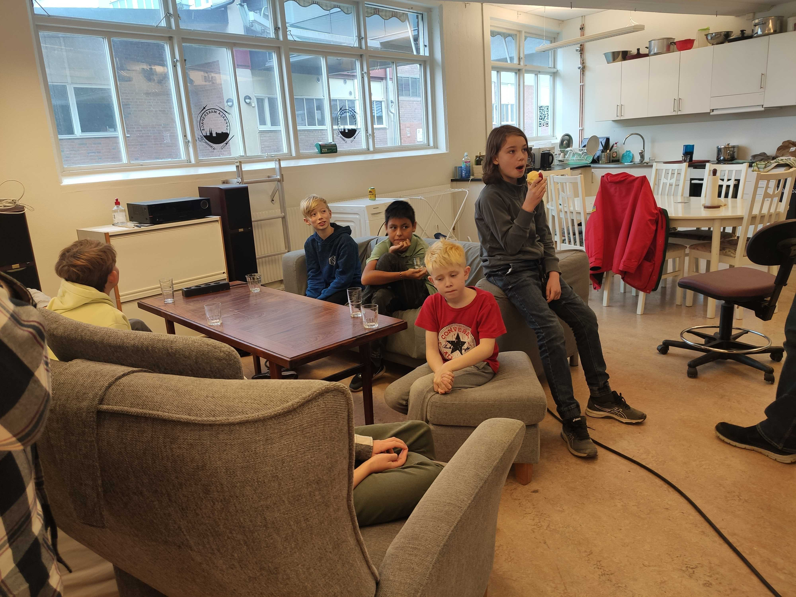
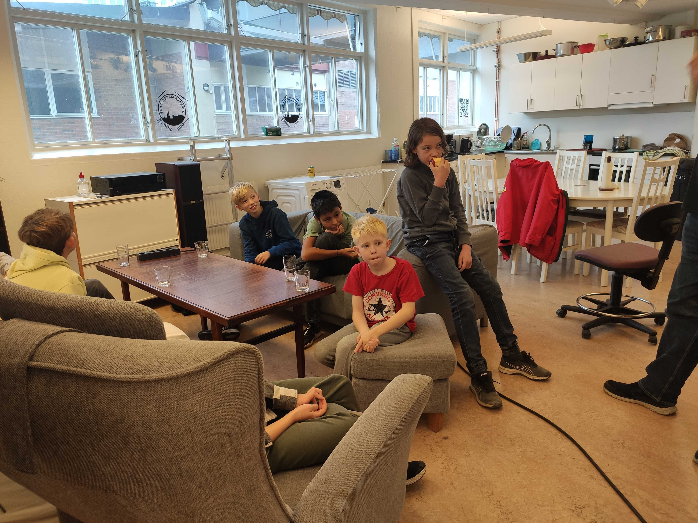
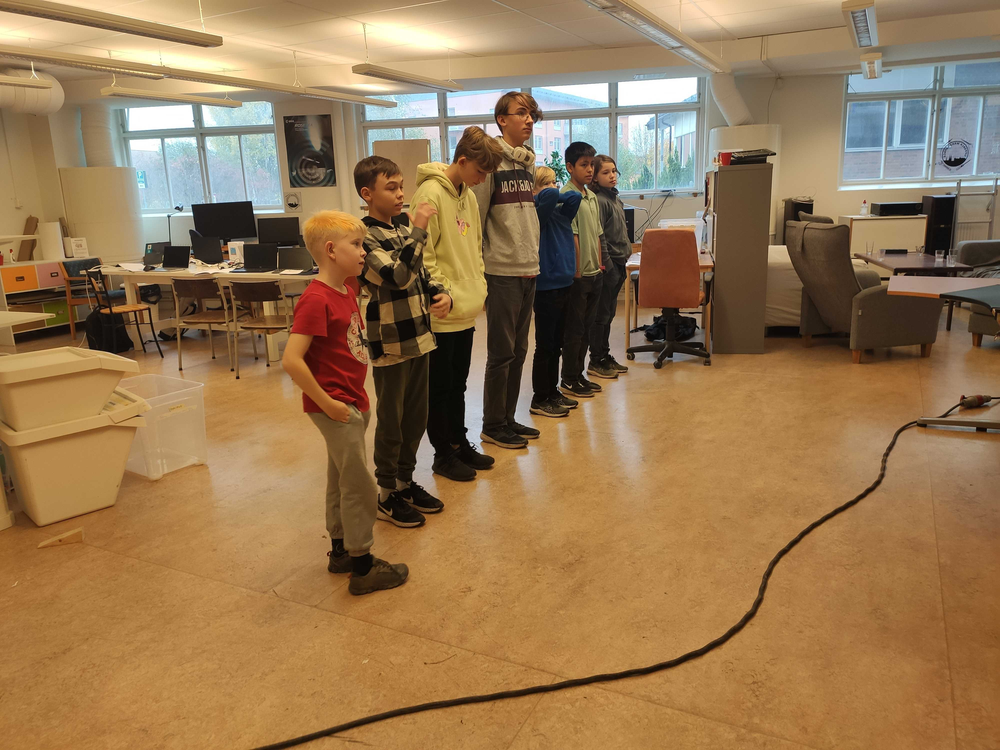
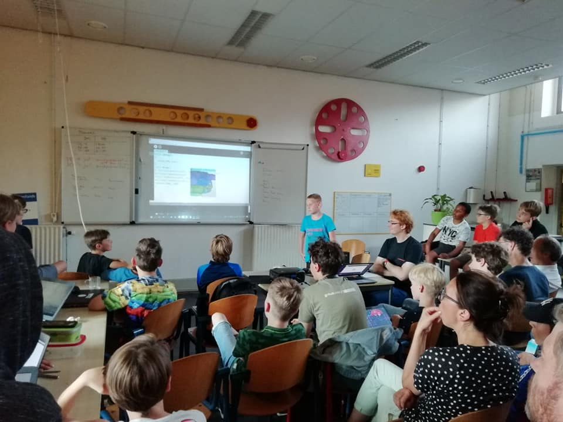

# Programmeringskurs för ungdomar


Att berätta för datorn vad den ska göra är kärnan inom programmering.
Vill du också kunna göra det? Varje vecka kan du besöka oss
och lära dig att göra något coolt (datorspel!) på datorn.

Först arbetar du dig igenom våra häften för att lära dig grunderna.
Efter ditt första diplom får du joina ett programmeringslag.
Och efter det, kanske du kommer att leda ditt eget lag!

Ingen förkunskaper krävs.

Det viktigaste i kursen är att lära sig programmera tillsammans.
Du börjar alltid med programmeringsspråket Processing.
Därefter, när du är i ett lag, kan ni välja ert eget programmeringsspråk.

Se "Schema" nedan för mer information.

## Dagschema

 * Första kursdagen: 8:e Januari 2022 (men du är alltid välkommen!)
 * Dag: Varje lördag, utom på röda dagar, sommarlov och jullov
 * Ålder: 8-18 år [*](faq.md)

När  |Vad
-----|---------
10:00|Dörren öppen
10:15|Start
11:00|Rast
11:15|Fortsättning
12:00|Slut

 * Plats: Uppsala Makerspace i Uppsala, [https://www.uppsalamakerspace.se/](https://www.uppsalamakerspace.se/),
   Ekeby Bruk 6M, 752 63 Uppsala
 * Kostnad per elev:
   * September till december: 400 kr för Uppsala Makerspace medlemmar, 600 kr för andra
   * Januari till maj: 400 kr för Uppsala Makerspace medlemmar, 600 kr för andra
 * Ålder: 8-18 år [*](faq.md)
 * Krav: en bärbar dator med WiFi [*](faq.md)

Din första lektion kan vara vilken dag som helst.
Även utan förvarning.
Om du vet när du kommer är det trevligt om du berättar det för Richel: richel@richelbilderbeek.nl

Har du en annan fråga? Se [vanliga frågor](faq.md).

## Betala

Kursen kostar 400 kr för Uppsala Makerspace medlemmar
och 600 kr för andra (tips: medlemskap är 200 kr per år!).

Du kan betala in via antingen bankgiro (584-8056) eller Swish (123 056 57 47).
Snälla, använd formatet här (`PC` betyder 'Programming Course'):

```
PC: [nam], [email]
```

till exempel:

```
PC: Sven Svensson, sven@svensson.se
```

## Årschema

Den här schemat är en generellt ide. Ser veckoschema för detaljerna.

När      |Vad
---------|----------------------------
Januari  |Kursen 1:e semester
Juli     |Presentation och utvärdering 
Augusti  |Sommarlov
September|Kursen 2:e semester
December |Presentation och utvärdering

## Veckoschema

Vecka| Dag      |Vad
-----|----------|-------------------------------------
1    |2022-01-08|1. 2:e säsong, kursen förtsätter igen
2    |2022-01-15|2.
3    |2022-01-22|3.
4    |2022-01-29|4.
5    |2022-02-05|5.
6    |2022-02-12|6.
7    |2022-02-19|7.
.    |2022-02-21|Borjan sportlov [1]
.    |2022-02-25|Slut sportlov [1]
8    |2022-02-26|8.
9    |2022-03-05|9.
10   |2022-03-12|10.
11   |2022-03-19|11.
12   |2022-03-26|12.
13   |2022-04-02|13.
14   |2022-04-09|14.
14   |2022-04-11|Början Påsklov [2]
14   |2022-04-14|Slut Påsklov [2]
15   |2022-04-16|15.
16   |2022-04-23|16.
17   |2022-04-30|17.
18   |2022-05-07|18.
19   |2022-05-14|19.
20   |2022-05-21|20. Förberada presentation
21   |2022-05-28|21.
22   |2022-06-04|22.
23   |2022-06-11|23.
24   |2022-06-18|24. ?Öva presentation
25   |2022-06-25|25. Öva presentation eller Midsommarsdagen?
26   |2022-07-02|26. Slutpresentation
27   |2022-07-09|27. Sista lektion
28   |2022-07-11|Början sommarlov [1]
29   |.         |Sommarlov [1]
30   |.         |Sommarlov [1]
31   |.         |Sommarlov [1]
32   |.         |Sommarlov [1]
33   |2022-08-17|Slut Sommarlov [1]
33   |2022-08-20|3:e säsong, kursen förtsätter igen

 * [1] https://skollov-se.se/skollov-2022/
 * [2] https://skollov-se.se/p%C3%A5sklov-2022/

## Impressum

### Julkort 2021

 * [Kolla på YouTube](https://youtu.be/YIf3dGh4ikY)
 * [Ladda ner videon (.mp4)](programs/julkort_20211218/julkort_20211218.mp4)



### 9:e Oktober 2021

Den 9:e Oktober såg kurs så ut:

 * [Kolla på YouTube](https://youtu.be/xWUhRymx69w)


Rast:





Galenlektion:



### Äldre bilder

Bilderna är från Richels sista kurs på [De Jonge Onderzoekers Groningen](https://www.djog.nl/):

På en öppen dag undervisar våra elever (i oranga T-shirts) våra gäster:


På slutet av en termin hade vi en presentation:




> Alla bilder är användet med vänligt tillstånd av 'De Jonge Onderzoekers Groningen'

## Länkar

 * [Uppsala Makerspace hemsida](https://www.uppsalamakerspace.se/)
 * [Kursbok: 'Processing för ungdomar'](https://github.com/richelbilderbeek/processing_foer_ungdomar)
