# Programmeringskurs


> If you are from Ukraine, you are welcome! See [FAQ](faq.md)
>
> Якщо ви з України, ласкаво просимо. [Перегляньте поширені запитання](faq.md)

Att berätta för datorn vad den ska göra är kärnan inom programmering.
Vill du också kunna göra det? Varje vecka kan du besöka oss
och lära dig att göra något coolt (datorspel!) på datorn.

Först arbetar du dig igenom våra häften för att lära dig grunderna.
Efter ditt första diplom får du joina ett programmeringslag.
Och efter det, kanske du kommer att leda ditt eget lag!

Inga förkunskaper krävs.

Det viktigaste i kursen är att lära sig programmera tillsammans.
Du börjar alltid med programmeringsspråket Processing.
Därefter, när du är i ett lag, kan ni välja ert eget programmeringsspråk.

Se "Schema" nedan för mer information.

## Dagschema

 * Startdatum: Finns ej! Du är alltid välkommen!
 * Dag: Varje lördag, utom på röda dagar, sommarlov och jullov
 * Ålder: 8-88 år [*](faq.md)

När  |Vad
-----|------------
10:00|Dörren öppnas
10:15|Start       
11:00|Rast        
11:15|Fortsättning
12:00|Slut/rast        
12:15|Möjlig fortsättning för elever med ett diplom och vuxen
13:00|Slut

 * Plats: Uppsala Makerspace i Uppsala, [https://www.uppsalamakerspace.se/](https://www.uppsalamakerspace.se/),
   Ekeby Bruk 6M, 752 63 Uppsala
 * Kostnad per elev:
   * September till december: 400 kr för Uppsala Makerspace medlemmar, 600 kr för andra
   * Januari till maj: 400 kr för Uppsala Makerspace medlemmar, 600 kr för andra
 * Ålder: 8-88 år [*](faq.md)
 * Krav: en bärbar dator med WiFi [*](faq.md)

Din första lektion kan vara vid vilket av tillfällena som helst, även utan föranmälan.
Om du vet att du kommer uppskattas det om du meddelar det till Richel: richel@richelbilderbeek.nl

Har du en annan fråga? Se [vanliga frågor](faq.md).

## Betalning

Kursen kostar 400 kr för Uppsala Makerspace medlemmar
och 600 kr för andra per halvår (tips: medlemskap är 200 kr per år!).

Du kan betala in via antingen bankgiro (584-8056) eller Swish (123 056 57 47).
Snälla, använd detta format (`PC` betyder 'Programming Course'):

```
PC: [nam], [email]
```

till exempel:

```
PC: Sven Svensson, sven@svensson.se
```

## Årschema

Detta är det övergripande schemat. Ser veckoschema för detaljerna.

När      |Vad
---------|----------------------------
Januari  |Kursen 1:e semester
Juli     |Presentation och utvärdering 
Augusti  |Sommarlov
September|Kursen 2:e semester
December |Presentation och utvärdering

## Veckoschema

Vecka| Dag      |Vad
-----|----------|-------------------------------------
33   |2022-08-20|1. Programmeringskursen förtsätter igen
34   |2022-08-27|2. Skapa T-shirt med/för 3 elever
35   |2022-09-03|3. Skapa T-shirt med/för sista elever
36   |2022-09-10|4. [Kulturnatten](activities/20220910_kulturnatten.md): vi undervisar!
37   |2022-09-17|5.
38   |2022-09-24|6.
39   |2022-10-01|7.
40   |2022-10-08|8.
41   |2022-10-15|9.
42   |2022-10-22|10.
43   |2022-10-29|11.
44   |2022-11-05|12.
45   |2022-11-12|13.
46   |2022-11-19|14. [Efterfarsdag](activities/20221119_efterfarsdag.md) (också farfar, morfar, osv)
47   |2022-11-26|15.
48   |2022-12-03|16. 
49   |2022-12-10|17. [Slutpresentation och utvärdering](activities/20221210_slutpresentation.md) (varje en är välkomna)
50   |2022-12-17|18. Sista dag
51   |2022-12-24|Jullov
52   |2022-12-31|Jullov
52   |2022-12-30|Jullov
 1   |2023-01-07|1. Kurs försätter igen

## Impressum

### Slutpresentation på 2022-05-28

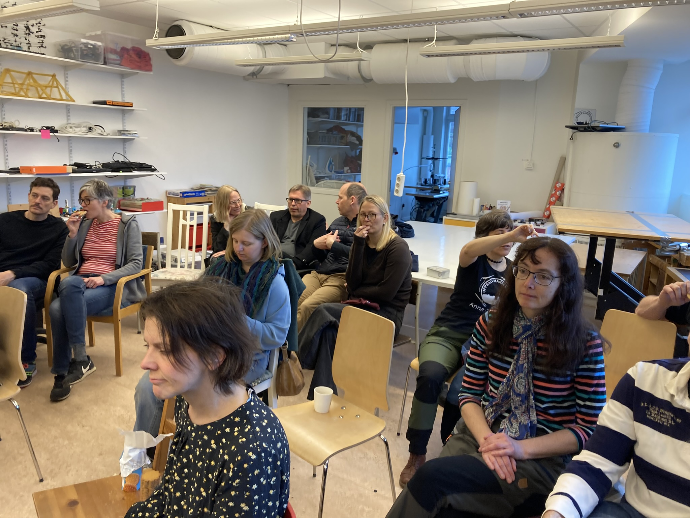

> Publiken före presentationen

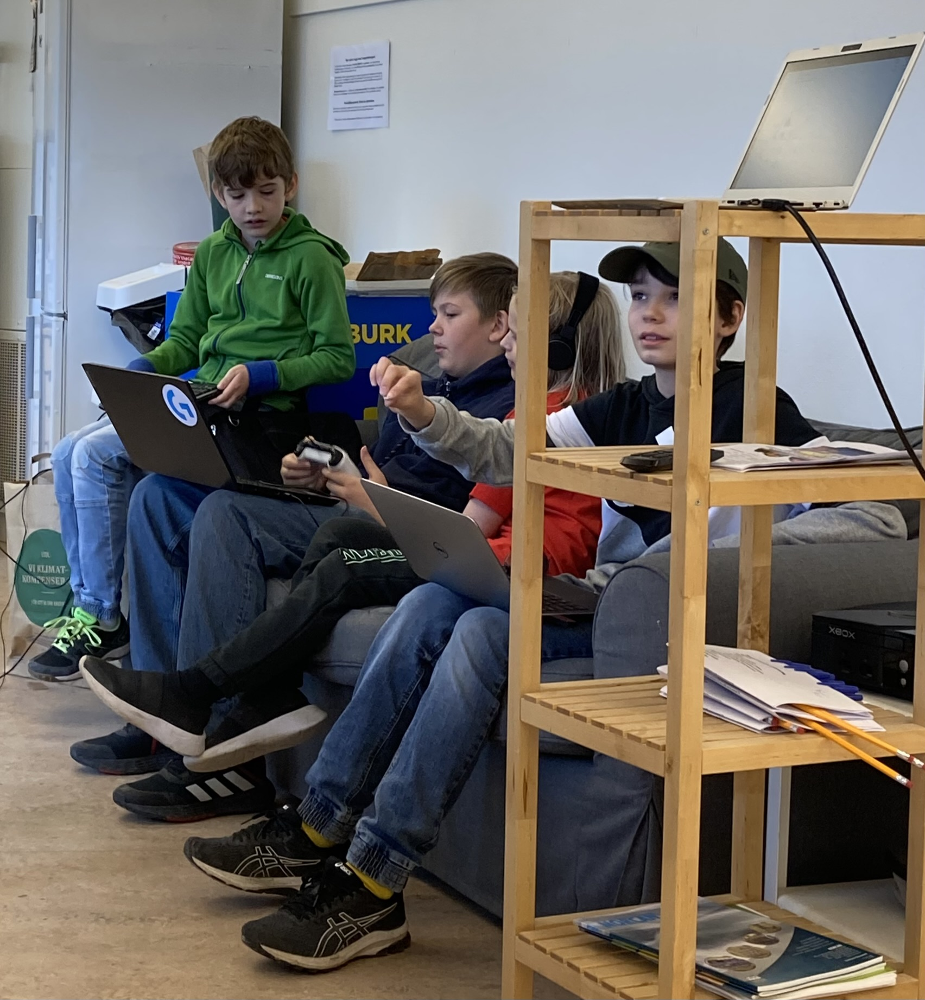

> Eleverna före presentationen

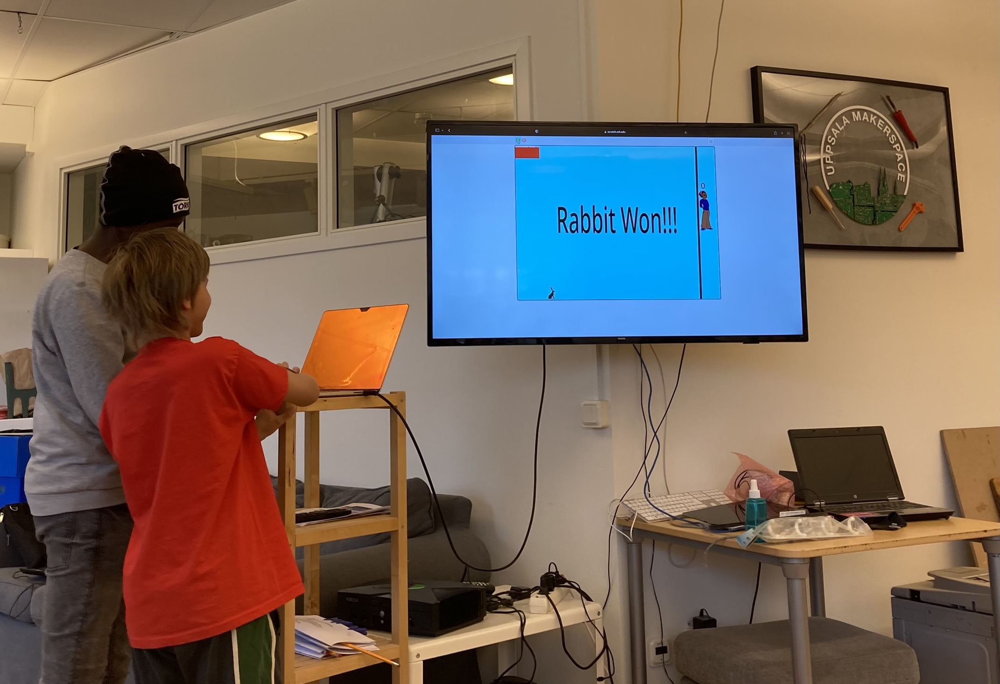
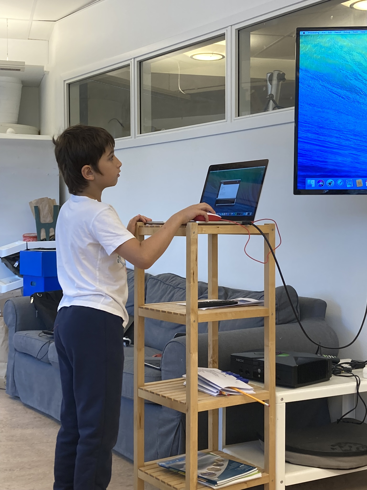
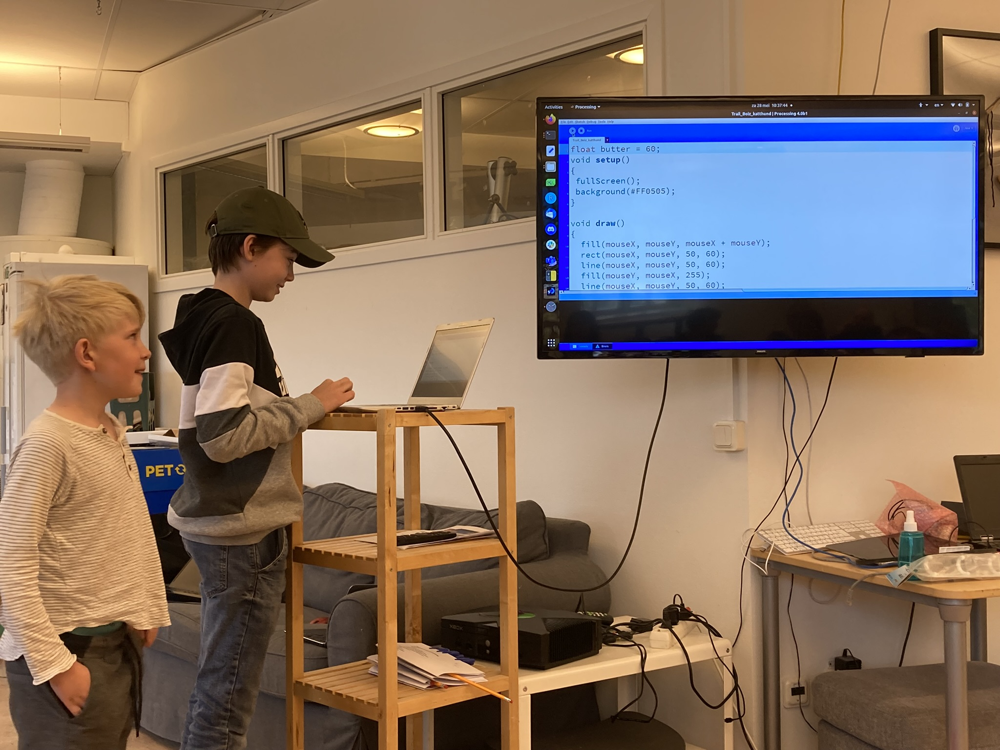
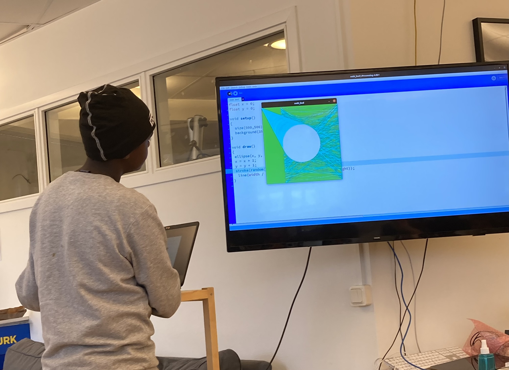
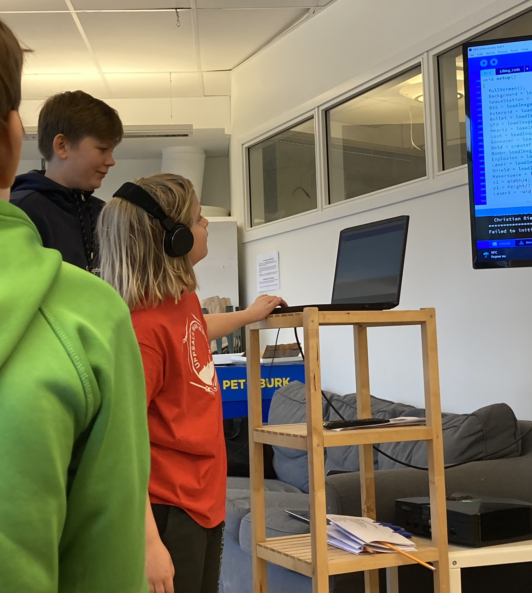


### [Programmeringsdag](github.com/richelbilderbeek/programmeringsdag_usb_2022)

[Programmeringsdag](github.com/richelbilderbeek/programmeringsdag_usb_2022)
var en aktivitet organiserat tillsammans med Uppsala Stadsbibliotek. 
19 personer deltog, 7 av dem var från oss!

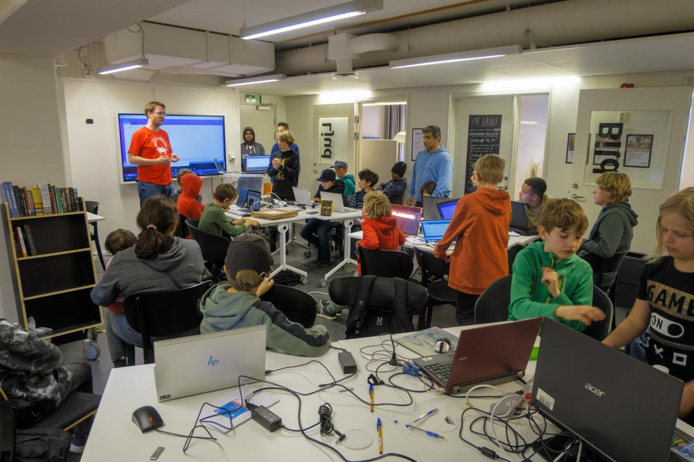

### 26:e Februar 2022

Vi hade haft våra första två diplomanter! Grattis killar!

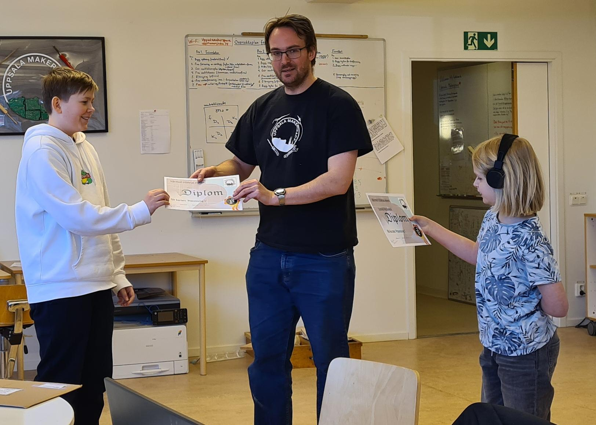

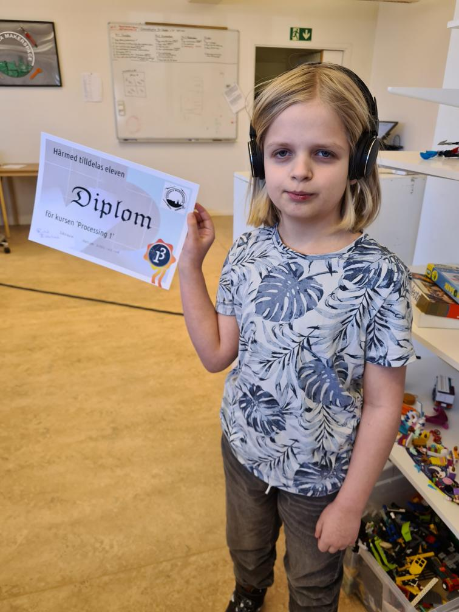

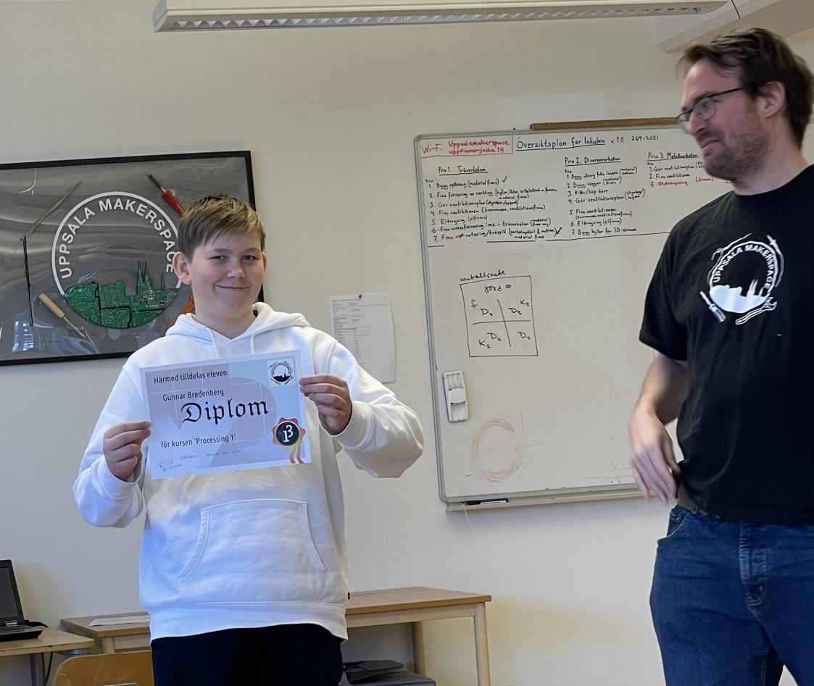

### Julkort 2021

 * [Kolla på YouTube](https://youtu.be/YIf3dGh4ikY)
 * [Ladda ner videon (.mp4)](programs/julkort_20211218/julkort_20211218.mp4)


### 9:e Oktober 2021

Den 9:e Oktober såg kursen ut så här:

 * [Kolla på YouTube](https://youtu.be/xWUhRymx69w)


Rast:


Galenlektion:


## Andra kurser

**Arduino**: om du tycker mer om Arduino (elektronik och programmering), 
kollar på [Arduinokurs](https://github.com/richelbilderbeek/arduinokurs).

**Programmeringslag**: om du är 13 år eller äldre, 
kan du också joina [programmeringslag 'tresinformal'](https://github.com/tresinformal/game).

## Länkar

 * [Uppsala Makerspace hemsida](https://www.uppsalamakerspace.se/)
 * [Kursbok: 'Processing för ungdomar'](https://github.com/richelbilderbeek/processing_foer_ungdomar)
 * [Arduinokurs](https://github.com/richelbilderbeek/arduinokurs)
 * [Programmeringslag 'tresinformal'](https://github.com/tresinformal/game)
 * [codeberg.org: 'git for youngsters' hemsida](https://codeberg.org/richelbilderbeek/git_for_youngsters)

