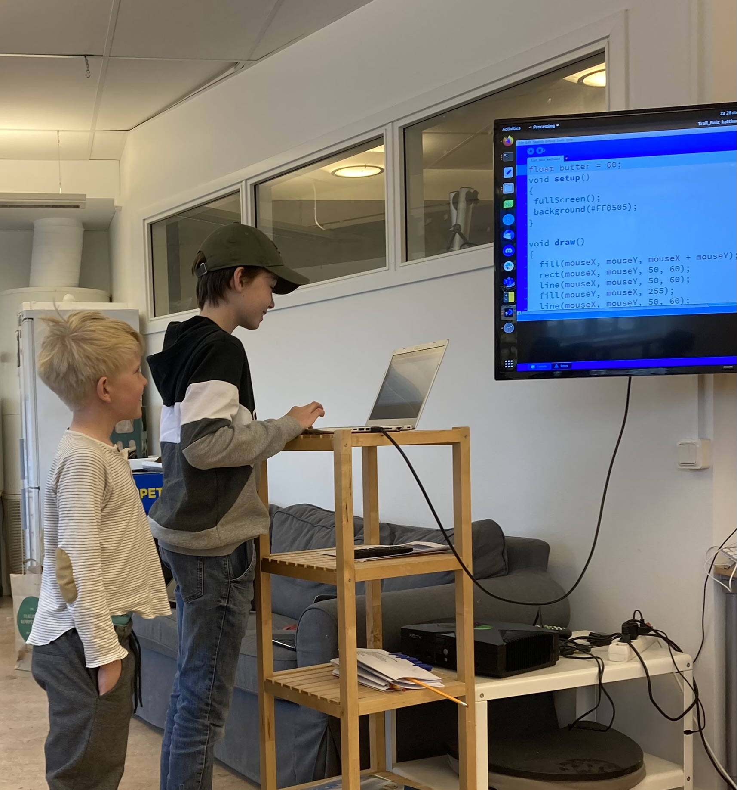

# Slutpresentation och utvärderig

> En tidigare slutpresentation

 * Målet: att elever får visar deras mästarevärk
 * Vem: varje en
 * Var: Uppsala Makerspace
 * Kostnad: ingenting
 * Tiderna: samma schema som vanligt

När  |Besökare                       | Elever
-----|-------------------------------|-----------
 9:00|Dör öpnas                      | Dör öpnas
10:00|Dör öpnas                      | Dör öpnas
10:15|Väntar med kaffe, te och kakor | Förbereda presentation
10:30|Kollar på presentationer       | Ger presentationer
11:00|Rast                           | Rast
11:15|Utvärdering med föräldrar      | Anonym utvärdering
12:00|Slut                           | Slut

Tider är bara riklinjer, ofta slutar vi tidigare.

## Presentationsschema

Vem     |Vad
--------|---------------
.       |.
