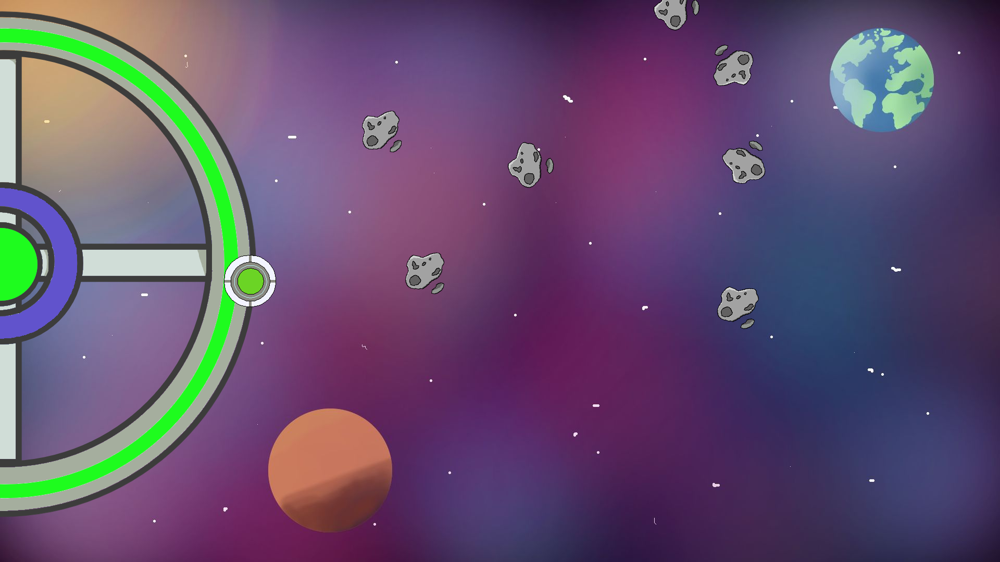
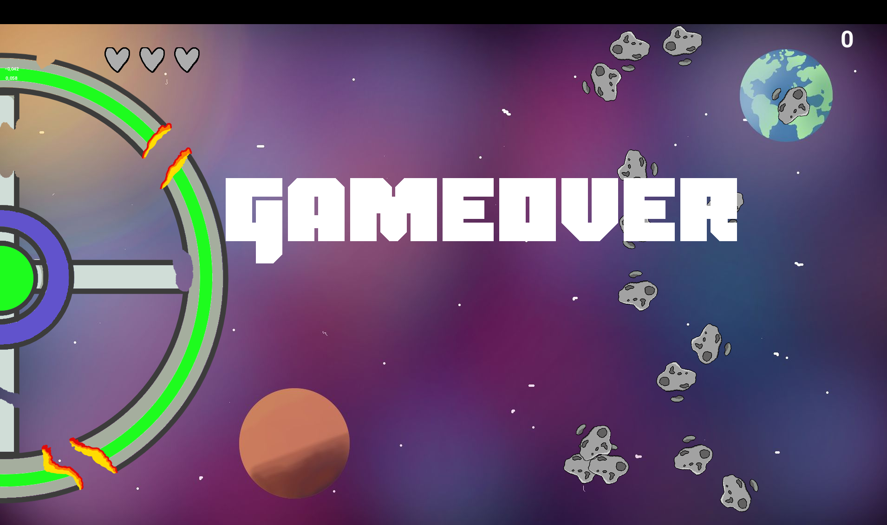

# Utvardering

Dag       |Vad                       
----------|------------------------------------------
2021-05-28|[Resultat](20220528/20220528.md)
2021-05-28|[Protokoll for interview with students (.odt)](20220528/protokoll.odt)
2021-05-28|[Protokoll for interview with students (.pdf)](20220528/protokoll.pdf)
2021-05-28|[Questions for interview with students (.odt)](20220528/questions.odt)
2021-05-28|[Questions for interview with students (.pdf)](20220528/questions.pdf)
2021-05-28|[Questions for interview with parents (.pdf)](20220528/questions_parents.md)
2021-05-28|[Table form for students (.odt)](20220528/utvardering.odt)
2021-05-28|[Table form for students (.pdf)](20220528/utvardering.pdf)
2021-12-11|[Resultat](20211211/20211211.md)
2021-12-11|[Protokoll for interview with students (.odt)](20211211/protokoll.odt)
2021-12-11|[Protokoll for interview with students (.pdf)](20211211/protokoll.pdf)
2021-12-11|[Questions for interview with students (.odt)](20211211/questions.odt)
2021-12-11|[Questions for interview with students (.pdf)](20211211/questions.pdf)
2021-12-11|[Table form for students (.odt)](20211211/utvardering.odt)
2021-12-11|[Table form for students (.pdf)](20211211/utvardering.pdf)

## Examples of what kids can do at their age

### 8 years old: 

 * simple works of art, e.g `(1, 0)` and `(1, 1)`

### 11 years old: 

 * more complex works of art, e.g `(2, 0)` and `(2, 1)`
 * re-create simple games

### 14 years old

 * beauty in works of art, e.g `(1, 2)`
 * complex games with own ideas

