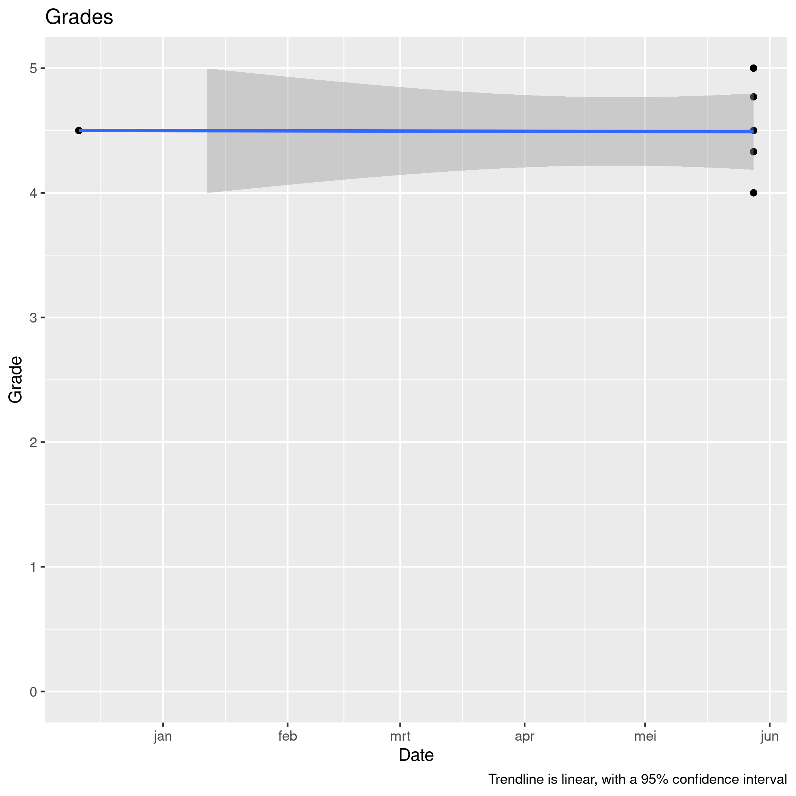

# Utvardering

Day       |Results
----------|------------------------------------------
2022-05-28|[2022-05-28](20220528/README.md)
2021-12-11|[2021-12-11](20211211/README.md)

## Examples of what kids can do at their age

### 8 years old: 

 * simple works of art, e.g `(1, 0)` and `(1, 1)`

### 11 years old: 

 * more complex works of art, e.g `(2, 0)` and `(2, 1)`
 * re-create simple games

### 14 years old

 * beauty in works of art, e.g `(1, 2)`
 * complex games with own ideas

