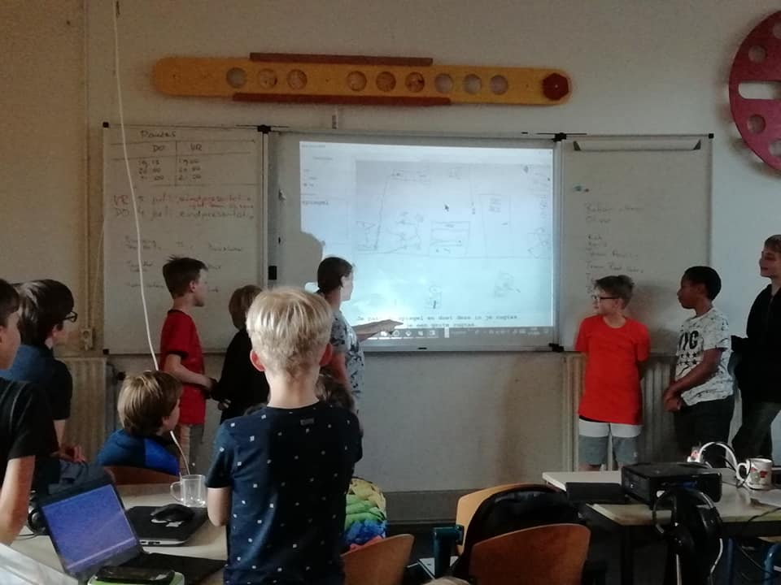
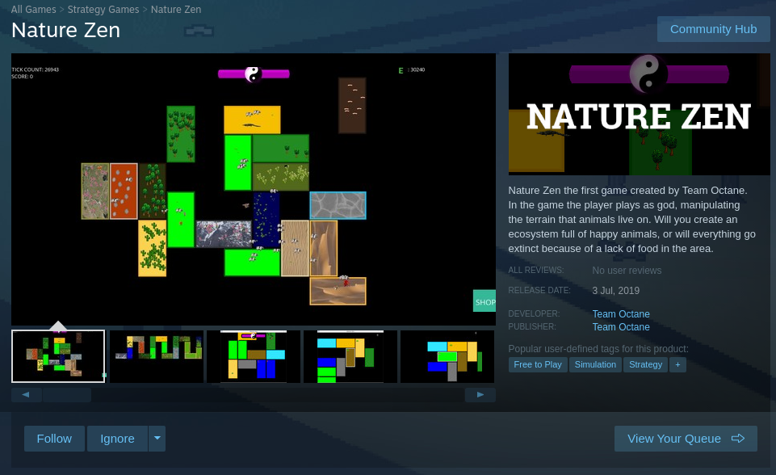
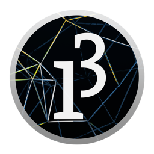

# FAQ

 * 🇸🇪 Vanliga frågor
 * 🇬🇧 Frequently asked questions: see below the Swedish ones
 * 🇺🇦 Часті запитання: див. англійську чи шведську

## 🇸🇪 Vanliga frågor

Nedan har jag listat ett antal vanliga frågor / fakta. För bättre översik har jag delat in dem i följande kategorier:

 * Komma igång
 * Ålder på deltagare
 * Kursmaterial
 * Programmeringsspråk - Processing (Java)
 * Förväntningar på deltagande (barn)
 * Förväntningar på föräldrar
 * Förväntningar på volontärer / frivilliga
 * Kostnad för kursen
 * Mer om läraren

## Komma igång

### När kan jag börja?

När som helst!

Det är alltid trevligt om du skickar ett mejl först till Richel, `richel@richelbilderbeek.nl`, så att han kan ta emot dig :-)

### Kan jag prova på en gång?

Javisst!

Det kostar ingenting första gången, det är viktigt att deltagarna känner att de hamnat rätt! 

Men skicka gärna ett mejl först till Richel, `richel@richelbilderbeek.nl`, så att är beredd att ta emot dig. :-)

### Om jag inte trivs, kan jag sluta när som helst?

Självklart!

Programmering är inte en hobby för alla.
Det är jättebra att du säger till om du har upptäckt att du gillar andra saker mer!

Men berätta gärna för Richel, om du precis börjat kan du få tillbaka kursavgiften.

## Ålder på deltagare

### Jag är under 8 år. Är jag välkommen?

Tack för att du läste detta, för 8 år är bara en riktlinje!
Denna riktlinje finns av en anledning: programmering är en
svår (men cool!) hobby.

Om du är yngre än 8 år och redan har kommit igång med att programmera är du mycket välkommen!

Vår erfarenhet säger oss att barn under 8 år som regel kan ha svårt att koncentrera sig långa stunder och det krävs också mer av läraren. Så vår riktlinje är att man bör vara minst 8 år gammal.

### Jag är över 18 år. Är jag välkommen?

Bra att du läste detta, för 18 år är bara en riktlinje!
Men kursen är i första hand riktad till minderåriga och de kommer få mest uppmärksamhet av läraren.

Samtidigt är det väldigt trevligt att ha vuxna på kursen, de bidrar till ett större lugn. Men om du deltar får du räkna med att jag kommer uppmuntra barnen att vara lärare till dig (de lär sig av detta)!

Kort sagt: kom förbi!

## Kursmaterial

### Vad ska jag ta med?

Du behöver en bärbar dator med laddare, observera att datorn inte behöver vara särskilt snabb eller avancerad då programmering inte kräver så mycket.
Det bästa är om du redan i förväg har [installerat Processing](https://processing.org/download/).

### Behöver jag ta med mig min mobil?

Nej, det är inte viktigt för att komma igång och programmera.
Det är faktiskt så att en mobil snarare stör din koncentration och kan hindra dig från att bli en bra programmerare! Erfarna programmerare brukar ofta bli irriterade när de blir störda mitt i, det bryter deras "flow" och ett enkelt avbrott kan göra att det tar 15-30 minuter att återfå koncentrationen.

Snälla, antingen lämna din mobil hemma eller stäng av den under kursen.

### Vilken böcker använder kursen?

Vi använder böcker av [Processing för toårigen](https://github.com/richelbilderbeek/processing_foer_ungdomar).

### Få jag drycker böcker själv?

Javisst! Bocker att [Processing för toårigen](https://github.com/richelbilderbeek/processing_foer_ungdomar)
ha en `CC-BY-NC` licens, 
som innehål du får drycker böcker själv för en kommerciell sak (`NC` = 'Non Commercial').
Också, du får ädrar texten, så långe du skriver också original version (`BY` = 'give attribution').

## Processing

### Varför ska jag lära mig just Processing?

Processing är ett programmeringsspråk som är framtaget för att ge en bra introduktion till programmering. Processing är också en dialekt av det populära programmeringsspråket Java och kan därmed bli ett naturligt steg mot mer avancerad programmering.  

Det är också så att vi har undervisningsmaterial och tidigare erfarenhet av undervisning i Processing vilket gör att du kan få bra hjälp.

### Varför inte använda Scratch?

Vår erfarenhet är att det fungerar mindre bra i en kurs av framförallt tre skäl:
1. Det är lätt att fastna i moment som är kreativa men som har mer med konst och storytelling än programmering att göra. 
2. Det är lätt att fastna i att spela olika färdiga program snarare än att skriva egna.
3. Scratch påminner är ett visuellt sätt att programmera som inte påminner så mycket om riktiga programmeringsspråk, det gör däremot processing.

Men scratch är ändå ett bra första steg för att komma igång, särskilt för yngre barn. Använd det gärna om du vill undervisa din(a) barn individuellt.

### Varför använder ni inte istället programmeringspråket [ditt favoritspråk]?

Det handlar till viss del om att ha bra undervisningsmaterial att utgå från och erfarenhet hos våra lärare och volontärer.

Men hör gärna av dig, det är möjligt att utvidga till fler programmeringsspråk.

### Får jag ockå lära mig fler programmeringsspråk?

Ja, när:

 * du har fått ditt första certifikat
 * du föreslår ett lag där du och tre andra barn ingår

Det kan vara programmeringspråk som:
 * C++ för Arduino
 * mBot
 * Javacsript

## Förväntningar på deltagande (barn)

### Vad händer på ett vanligt kurstillfälle?

  * du kommar hit när dörren öppnas 
  * du ställer upp din bärbara dator
  * du gör uppgifter i böckerna
  * du sammarbetar med dina bordskompisar

På rasten fikar vi och kopplar av lite.

Efter rasten förtsätter vi igen och på slutet städar vi upp.

### Vad händer på en presentation?

En presentation är ett speciellt tillfälle när vi presentera våra mästerverk.
Det brukar bli nästa sista kurstillfället på säsongen.

Du får bjuda in din familj och vänner om du vill. 
(Förutsett att situationen med Covid-19 tillåter det.)

Vi avslutar med en utvärdering av kursen (anonymt). Det är lite tråkigt men det är viktigt för oss för att kunna förbättra kursen!

> Nederländska barn har en presentation

### Vad händer på ett evenemang?

Om det finns intresse och tillfälle ges kan vi delta på olika evenemang, t.ex. Birdie eller SciFest.
Där kan finnas möjlighet att både visa upp vad som åstadkommits eller undervisa andra i att programmera. 

> Nederländska barn (i oranga T-skjörtor) undervisar andra barn på ett evenemang

### Kan jag göra datorspel?

Oh ja!

Att göra ett datorspel är ett av de roligaste sätten att lära sig programmering.

> Nature Zen är ett datorspel som är tillgänligt Steam

### Kan jag spela datorspel på kursen?

Nej.

I denna kurs kommer lärandet först.
Spel bidrar inte till att lära sig programmera.
Vi vill inte att man spelar i Uppsala Makerspaces lokaler. Varken före, under rasten eller efter att kursen slutat.
Men, om du *själv* har programmerat ett spel så får du naturligtvis visa upp spelet och låta andra testa det bara det inte tar över kursen.

### Vem ska jag fråga om jag fastnar?

Det bästa sättet att lära sig är att få berätta för en kompis.

 * Sitter det en deltagare bredvid dig? Om ja, fråga hen.
 * Sitter det en deltagare vid ditt bord? Om ja, då är hen.
 * Om du sitter själv vid ditt bord eller ingen vet, fråga en lärare / vuxen.

### Vad händer om en ny student kommer in?

 * Värd/värdinna tar hand om honom/henne:
   * Lägg på din kappa
   * Namnlista
   * Länkar till en student som vill starta honom / henne: de sitter sedan vid det stora bordet

### Jag kan inte komma på ett kurstillfälle!

Inget problem! 

Men skicka gärna ett mail till Richel,`richel@richelbilderbeek.nl` och meddela detta.

## Förväntningar på föräldrar

### Är jag välkommen att stanna?

Föräldrar är alltid välkommna att kolla lite vad som pågår på kursen.

Men, oftast är det bättre om ditt barn skapar nya bekantskaper på kursen och inte vänder sig till dig när det uppstår problem. 
Därför undrar vi om du kan hålla dig på lite avstånd under kursens gång -när så är möjligt- kanske ta en promenad eller göra ett ärende. Uppsala Makerspace är också rätt stort så det går att vistas i ett annat rum och hålla på med egna projekt om du är labbmedlem.

Ett tips: kom 5 minuter före slutet för en kort titt :-)

### Är jag välkommen att hjälpa till?

Javisst! Du kann bli en volontär. 
Vi försöker då ordna så du är i en annan grupp än ditt/dina barn, se frågan ovan.

### Mitt/minaa barn kan inte kom på ett kurstillfälle!

Inget problem! 

Men skicka gärna ett mail till Richel,`richel@richelbilderbeek.nl` och meddela detta.

## Förväntningar på volontärer / frivilliga

### Är jag välkommen?

Javisst!

Målsättningen är dock att barnen ska hjälpa varandra i så stor utsträckning som möjligt, så det ska helst inte vara fler än en vuxen per fyra barn.

## Lektioner och läromedel

### Var finns lektionerna?

Lektioner finns beskrivna på webbplatsen (översättning pågår). 
[Processing för ungdomar] (https://github.com/richelbilderbeek/processing_foer_ungdomar).

## Jag lära mig Processing och komma igång dirkt, hur går jag tillväga?

Kul, självklart kan du komma igång själv!
[Ladda ner Processing här](https://processing.org/download/).

Processing lektionerna finns på webbplatsen [Processing för ungdomar] (https://github.com/richelbilderbeek/processing_foer_ungdomar).

## Jag vill skapa på fler sätt än med datorn, är det möjligt?

Javisst, men detta är en programmeringskurs.

Lyckligtvis, det finns det andra aktiviteter för Makerkids i Uppsala Makerspace, hör av dig till föreningen på kansliet@uppsalamakerspace.se eller prata med någon på våra öppna kvällar!
Se också [tidigare aktiviteter](https://www.uppsalamakerspace.se/aktiviteter).

## Kostnader för kursen

### Vad kostar kursen?

[Detta är ett förslag]

 * 400 SEK för medlemmar
 * 600 SEK för ej-medlemmar

### Jag har inte råd med kursavgiften. Hur ska jag göra?

Hör av dig till Richel, han har förmodligen en lösning.

### Varför kostar kursen så lite?

För att kursen bedrivs med frivilliga krafter och det finns ett intresse att sprida kunskap om programmering i samhället.
Kostnaderna är i huvudsak för att trycka böckerna och lite fika.

### Varför fins det två priser?

Kursen har två priser: en för Uppsala Makerspace medlemmar och en för ej-medlemmar.

Det lägre av priserna är för Uppsala Makerspace medlemmar, de betalar bara för böcker och fika.

Det högre priset är för de som inte är medlemmar ännu, då de behöver bidra till kostnaden för lokalen.

### Varför kostar kursen samma mellan höst och vår?

För att det är lättare administrera

### Hur är pris från kursen räknet?

Priserna för kursen är framräknade utifrån kostnader på [Copy-Systems (Nederlands)](https://www.copy-systems.nl/).
Priserna är framräknade pessimistiskt.

En kurs kräver minst 8 böcker där varje bok innehåller 30 dubbelsidiga A4 sidor.

 * 1 bok 100 kr (färg, paa svartvit aar 1 bok 20 kr)

2 certifikat:

 * 1 certifikat är 54 kr (färg)

Lektionskort:

 * Färg: 1 kort är 10 kr

Saft:

 * 30 kr per flask för 10 elever

Presentation:

Per elev, 30 kr:

 * Kaffe för 1 föräldrar, 5 kr
 * te för 1 föräldrar, 5 kr
 * limonade för barn och 1 gast, 10 kr
 * Kakor, 4 personar, 10 kr

Per elev och termin:

 * 4x böcker = 400 kr
 * 1x certifikat = 54 kr
 * 1x lektionskort = 10 kr
 * 2x flaska saft = 60 kr
 * Presentation = 30 kr

Det betyder, 
i början när det inte finns några böcker, 
blir kostnaden 554 SEK per elev pro termin.
Det är en pessimistisk uppskattning.

## Personen

### Vem är volontärer?

 * Christoffer
 * Janne
 * Richel

### Vem är Christoffer?

Christoffer är volontär på kursen.

### Vem är Janne?

Janne är volontär på kursen.

### Vem är [Richel](https://github.com/richelbilderbeek)?

Richel är en vuxen volontär som samordnar kursen.

Richel har programmerat sedan han var 8 år.
Han är en erfaren programmerare, särskilt inom C++.
Richel är särskilt intresserad av utbildning och har
avslut lärarutbildningen vid universitetet och har två år som
lärare på en Högstadiet.

Hans arbete kan ses på 
[hans webbplats med mer än 3900 sidor](http://richelbilderbeek.nl)
och [mer än 1200 GitHub-arkiv](https://github.com/richelbilderbeek?tab=repositories).
Självklart har han gjört [många datorspelar](https://github.com/richelbilderbeek/games).

På dagtid jobbar Richel som [forskare på Uppsala Universitet](https://katalog.uu.se/empinfo/?id=N21-617).

## 🇬🇧🇺🇦 Frequently asked questions

In short: you are always welcome, just show up between 10:00-12:00. 
There is coffee and tea for parents and laptops and programming exercises
for the kids :-)

